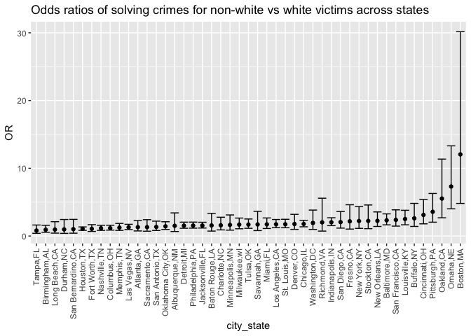

Homework 6
================
Anna Ostropolets
12/1/2020

# Problem 1

``` r
# loading the data
url <- getURL("https://raw.githubusercontent.com/washingtonpost/data-homicides/master/homicide-data.csv")
data <- read.csv(text = url)

aggregated_data<-
  data %>%
  mutate(
    city_state = str_c(city, state, sep = ","),
    # recode
    status = case_when(
      disposition == "Closed without arrest" ~ 0,
      disposition == "Open/No arrest" ~ 0,
      disposition == "Closed by arrest" ~ 1,
    ),
    victim_age = as.numeric(na_if(victim_age,'Unknown'))
  ) %>%
  filter(!city_state %in% c("Tulsa,AL", "Dallas,TX", "Phoenix,AZ",  "Kansas City,MO")
         & victim_race %in% c("White","Black"))
```

Odds ratios of solving homicides comparing white victims to non-white
victims in Baltimore

``` r
baltimore = 
  aggregated_data %>% 
  filter(city_state == "Baltimore,MD") %>%
  as.matrix()

glm(status ~ victim_age + victim_race + victim_sex,
    data = aggregated_data,
    family = binomial()) %>% 
  broom::tidy() %>% 
  mutate(
    OR = exp(estimate),
    CI_lower = exp(estimate - 1.96 * std.error),
    CI_upper = exp(estimate + 1.96 * std.error)
  ) %>% 
  filter(term == "victim_raceWhite") %>%
  select(OR, starts_with("CI")) 
```

    ## # A tibble: 1 x 3
    ##      OR CI_lower CI_upper
    ##   <dbl>    <dbl>    <dbl>
    ## 1  1.83     1.73     1.94

Running the same linear regression for all cities

``` r
glm <-
  aggregated_data %>% 
  nest(data = -city_state) %>% 
  mutate(
    models = 
      map(.x = data, ~glm(status ~ victim_age + victim_race + victim_sex, data = .x, family = binomial())),
    results = map(models, broom::tidy)
    ) %>%
  select(city_state, results) %>% 
  unnest(results) %>% 
  mutate(
    OR = exp(estimate),
    CI_lower = exp(estimate - 1.96 * std.error),
    CI_upper = exp(estimate + 1.96 * std.error)
  ) %>% 
  filter(term == "victim_raceWhite") %>%
  select(city_state, OR, starts_with("CI"))
```

A plot showing odds ratios of solving crimes for white vs non-white
victims across states.

``` r
  glm %>% 
  mutate(city_state = fct_reorder(city_state, OR)) %>% 
  ggplot(aes(x = city_state, y = OR)) +
  geom_point() + 
  geom_errorbar(aes(ymin = CI_lower, ymax = CI_upper)) + 
  theme(axis.text.x = element_text(angle = 90, vjust = 0.5, hjust = 1)) +
  labs(title = "Odds ratios of solving crimes for non-white vs white victims across states")
```

<!-- -->

# Problem 2

Import data for problem 2

``` r
birth_weight = 
  read_csv("./birthweight.csv") %>% 
  drop_na() %>%
  # recoding
   mutate(
     mrace = case_when(
      mrace == 1 ~ "White",
      mrace == 2 ~ "Black",
      mrace == 3 ~ "Asian",
      mrace == 4 ~ "Puerto Rican",
      mrace == 8 ~ "Other"),
     # converting to factors
     mrace = as.factor(mrace),
    frace = as.factor(frace),
    malform = as.factor(malform),
    babysex = case_when(
      babysex == 1 ~ "Male",
      babysex == 2 ~ "Female"), 
   babysex = as.factor(babysex))
```

The regression models accounts for the known factors that influence
birth weight: gestational age, baby gender, smoking, mother’s age and
malformations that can affect weight and mother’s obesity, all of which
have been already reported to have an association with low birth weight
(<https://pediatrics.aappublications.org/content/84/3/A90.1>). We
converted number of cigarettes and pre-pregnancy weight into binary
variables. We hypothesized that mother’s race is a predictor of low
birth weight independent (conditioned on) of the factors above.

``` r
lm_data <-
  birth_weight %>%
   mutate(
     obesity = case_when(
      ppbmi >40 ~ 1,
      ppbmi <=40 ~ 0),
      obesity = as.factor(obesity),
    smoking = case_when(
      smoken >0 ~ 1,
      smoken == 0 ~ 0),
     smoking = as.factor(smoking)) %>%
   select (mrace,  obesity, smoking, momage, babysex, bwt, gaweeks, malform, bhead, blength )  


first_model = lm(bwt ~ mrace + obesity + smoking + momage + babysex + gaweeks + malform, data = lm_data)

# plotting
 mdl =
  lm_data %>% 
  modelr::add_residuals(first_model) %>% 
  modelr::add_predictions(first_model)  %>%
  ggplot(aes(x = mrace, y = resid)) + 
  geom_point() +
  labs(title = "Model residuals")
  
first_model = lm(bwt ~ mrace + obesity + smoking + momage + babysex + gaweeks + malform, data = lm_data) 
second_model = lm(bwt ~ blength + gaweeks, data = lm_data)
third_model = lm(bwt ~ bhead*blength*babysex , data = lm_data)
```

We can see that residuals are different for Asians

``` r
# create df for cross-validation
cross_val =
  crossv_mc(lm_data, 100) %>% 
  mutate(
    train = map(train, as_tibble),
    test = map(test, as_tibble))

cross_val = 
  cross_val %>% 
  mutate(
    first_model  = map(train, ~lm(bwt ~ mrace + obesity + smoking + momage + babysex + gaweeks + malform, data = .x)),
    second_model =  map(train, ~lm(bwt ~ blength + gaweeks, data = .x)),
    third_model  = map(train, ~lm(bwt ~ bhead*blength*babysex, data = .x))
    ) %>% 
  mutate(
    rmse_one = map2_dbl(first_model, test, ~rmse(model = .x, data = .y)),
    rmse_two = map2_dbl(second_model, test, ~rmse(model = .x, data = .y)),
    rmse_three = map2_dbl(third_model, test, ~rmse(model = .x, data = .y)))

# Plot error distribution
cross_val %>% 
  select(starts_with("rmse")) %>% 
  pivot_longer(
    everything(),
    names_to = "model", 
    values_to = "rmse",
    names_prefix = "rmse_") %>% 
  mutate(model = fct_inorder(model)) %>% 
  ggplot(aes(x = model, y = rmse)) +
  geom_violin()
```

<!-- -->

# Problem 3

Data loading

``` r
weather_df = 
  rnoaa::meteo_pull_monitors(
    c("USW00094728"),
    var = c("PRCP", "TMIN", "TMAX"), 
    date_min = "2017-01-01",
    date_max = "2017-12-31") %>%
  mutate(
    name = recode(id, USW00094728 = "CentralPark_NY"),
    tmin = tmin / 10,
    tmax = tmax / 10) %>%
  select(name, id, everything())
```

    ## Registered S3 method overwritten by 'hoardr':
    ##   method           from
    ##   print.cache_info httr

    ## using cached file: /Users/aostropolets/Library/Caches/R/noaa_ghcnd/USW00094728.dly

    ## date created (size, mb): 2020-12-04 21:08:38 (7.534)

    ## file min/max dates: 1869-01-01 / 2020-12-31

Creating lm and bootstraping

``` r
weather_model = lm(tmax ~tmin, data=weather_df)

bootstraps= weather_df %>% 
  modelr::bootstrap(n = 5000) %>% 
  mutate(
    weather_model = map(strap, ~lm(tmax ~tmin, data=.x)),
    results = map(weather_model, broom::tidy),
    summary= map(weather_model, broom::glance)
    ) 
```

Plot the distribution of estimates

``` r
# compute log of beta and intercept
estim = 
  bootstraps %>% 
  select(-strap, -.id, -weather_model) %>% 
  unnest(results) %>% 
  select(term,estimate) %>%
  mutate(term = as.factor(term)) %>%
  pivot_wider(
    names_from = term,
    values_from = estimate
  ) %>%
  unnest() %>%
  rename (Intercept = '(Intercept)') %>%
  mutate(logs = log(tmin*Intercept))
```

    ## Warning: Values are not uniquely identified; output will contain list-cols.
    ## * Use `values_fn = list` to suppress this warning.
    ## * Use `values_fn = length` to identify where the duplicates arise
    ## * Use `values_fn = {summary_fun}` to summarise duplicates

    ## Warning: `cols` is now required when using unnest().
    ## Please use `cols = c(`(Intercept)`, tmin)`

``` r
estim %>%
  ggplot(aes(x = logs)) + 
  geom_density() +
  labs(title="Distribution of effect estimates")
```

<!-- -->

``` r
bootstraps %>% 
  select(-strap, -.id, -weather_model) %>% 
  unnest(summary) %>%
  ggplot(aes(x = r.squared)) + 
  geom_density() +
  labs(title="<Distribution of r2>")
```

<!-- --> Distribution
of effect estimates follows normal distribuition with mean \~ 2.01

# Computing 95% CI

``` r
# for effect estimates
 estim %>%
  summarize(
    estim_CI_low = quantile(logs, 0.025),
    estim_CI_upper = quantile(logs, 0.975),
  )
```

    ## # A tibble: 1 x 2
    ##   estim_CI_low estim_CI_upper
    ##          <dbl>          <dbl>
    ## 1         1.97           2.06

``` r
# for r22
bootstraps %>% 
  select(-strap, -.id, -weather_model) %>% 
  unnest(summary) %>% 
  summarize(
    r2_CI_low = quantile(r.squared, 0.025),
    r2_CI_upper = quantile(r.squared, 0.975)
  )
```

    ## # A tibble: 1 x 2
    ##   r2_CI_low r2_CI_upper
    ##       <dbl>       <dbl>
    ## 1     0.893       0.927
